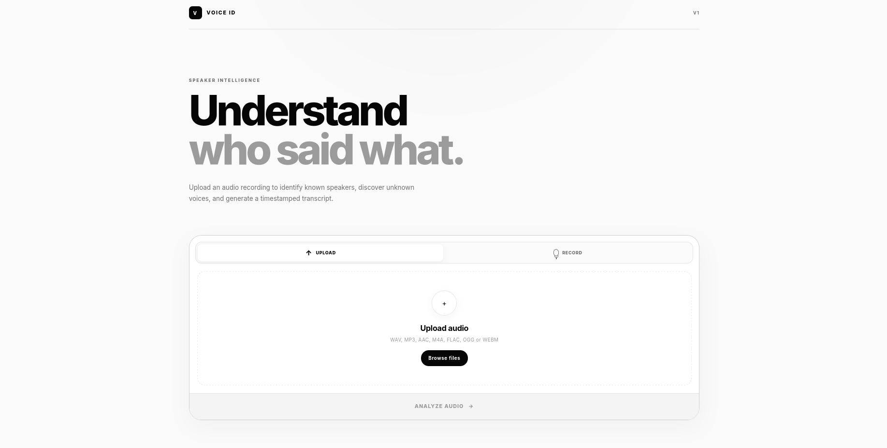
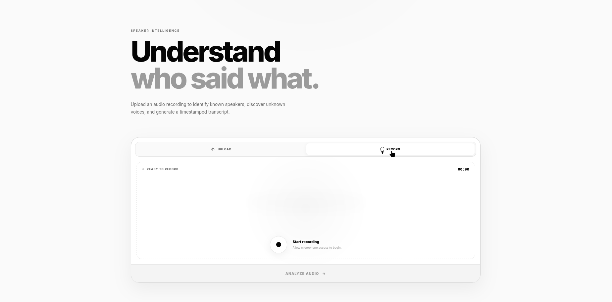
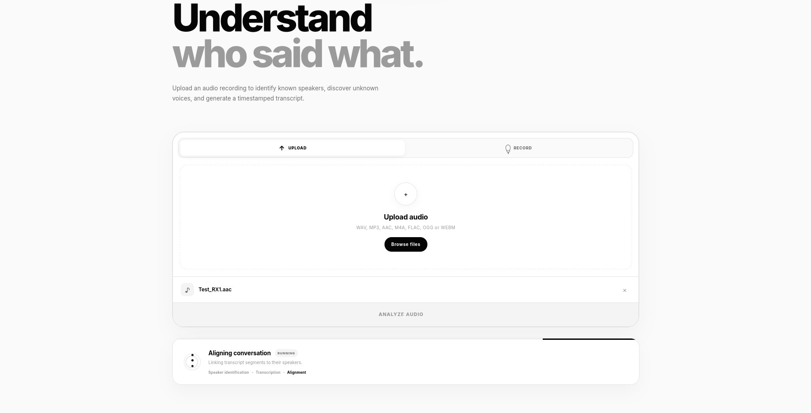
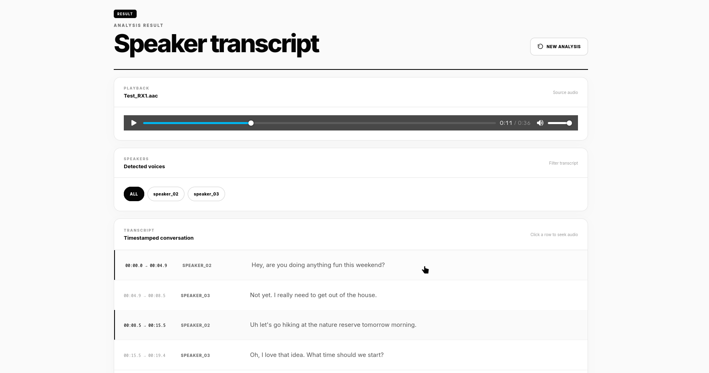
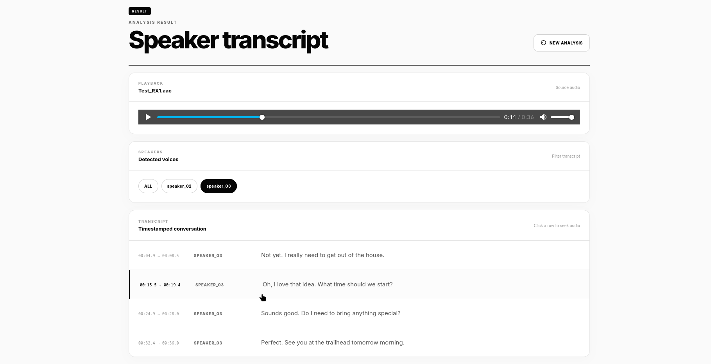

# Voice ID

> Understand who said what.

> **Live Demo:** [Try Voice ID →](https://voice-id-193447150189.asia-south1.run.app)

Voice ID is a speaker-intelligence application that analyzes an audio recording, identifies registered speakers, discovers previously unknown speakers, generates a timestamped transcription, and aligns the transcript with the detected speakers.

It combines speaker diarization, ECAPA-TDNN speaker embeddings, speaker-profile matching, unknown-speaker clustering, Gemini transcription, and timestamp alignment into a single processing pipeline.

---

## Overview

Voice ID takes an audio recording through the following pipeline:

```text
Audio
  │
  ▼
Audio normalization
  │
  ▼
Speaker diarization
  │
  ├── Speech segmentation
  ├── Speaker-turn detection
  ├── ECAPA-TDNN embeddings
  ├── Known-speaker matching
  └── Unknown-speaker discovery
  │
  ▼
Gemini transcription
  │
  ▼
Timestamp alignment
  │
  ▼
Speaker-attributed transcript
```

The final result contains:

- Detected speakers
- Known speaker identities
- Dynamically discovered unknown speakers
- Timestamped transcript segments
- Speaker attribution for transcript segments
- Audio playback with timestamp seeking

The complete pipeline is implemented as:

```text
Diarization
    ↓
Gemini transcription
    ↓
Speaker / transcript alignment
    ↓
Final speaker-attributed transcript
```

---

## Features

### Speaker Intelligence

- Identify registered speakers from their voice profiles
- Detect speaker turns within an audio recording
- Generate ECAPA-TDNN speaker embeddings
- Compare embeddings using cosine similarity
- Build normalized speaker profiles from enrollment recordings
- Discover previously unknown speakers
- Maintain dynamically discovered unknown-speaker profiles
- Apply temporal resolution and smoothing to speaker assignments

### Transcription

- Audio transcription using Google Gemini
- Timestamped transcription segments
- Language information returned with transcription
- Normalization of transcription results

### Alignment

- Align transcription timestamps with diarization segments
- Produce speaker-attributed transcript segments
- Preserve start and end timestamps

### Web Application

- Audio upload interface
- Drag-and-drop upload
- Supported audio formats:
  - WAV
  - MP3
  - AAC
  - M4A
  - FLAC
  - OGG
  - WEBM
- Upload size limit of 200 MB
- Audio playback
- Click transcript rows to seek through the audio
- Filter transcript by detected speaker
- Analysis progress state
- Error handling
- New-analysis reset flow

---

# Architecture

## System Architecture

```text
                         ┌─────────────────────┐
                         │      Web Browser     │
                         └──────────┬──────────┘
                                    │
                              Audio Upload
                                    │
                                    ▼
                         ┌─────────────────────┐
                         │      Flask API      │
                         │                     │
                         │  /                 │
                         │  /api/analyze      │
                         └──────────┬──────────┘
                                    │
                                    ▼
                         ┌─────────────────────┐
                         │ Audio Normalization │
                         └──────────┬──────────┘
                                    │
                                    ▼
                         ┌─────────────────────┐
                         │ Speaker Diarization │
                         │                     │
                         │ VAD                 │
                         │ Segmentation        │
                         │ Speaker Turns       │
                         │ ECAPA Embeddings    │
                         └──────────┬──────────┘
                                    │
                    ┌───────────────┴───────────────┐
                    ▼                               ▼
          ┌──────────────────┐            ┌──────────────────┐
          │ Known Speakers   │            │ Unknown Speakers │
          │                  │            │                  │
          │ Profiles         │            │ Dynamic Profiles │
          │ Cosine Similarity│            │ Matching         │
          └────────┬─────────┘            └────────┬─────────┘
                   │                               │
                   └───────────────┬───────────────┘
                                   │
                                   ▼
                         ┌─────────────────────┐
                         │  Gemini Transcribe  │
                         └──────────┬──────────┘
                                    │
                                    ▼
                         ┌─────────────────────┐
                         │ Timestamp Alignment │
                         └──────────┬──────────┘
                                    │
                                    ▼
                         ┌─────────────────────┐
                         │ Final Transcript    │
                         │ + Speaker Identity  │
                         └─────────────────────┘
```

---

# Machine Learning Pipeline

## 1. Audio Normalization

Uploaded audio is normalized before entering the ML pipeline.

Supported input formats are converted into the format expected by the processing pipeline.

---

## 2. Speaker Diarization

The diarization system processes the audio to determine:

- Where speech occurs
- Where speaker changes may occur
- Which segments belong to which speaker

Speaker-turn detection uses overlapping audio windows and compares consecutive ECAPA-TDNN embeddings. A sufficiently low similarity indicates a possible speaker boundary.

The current implementation uses:

```text
Window: 2.0 seconds
Step:   1.0 second
```

Speaker-turn detection is based on cosine similarity between consecutive embeddings.

---

## 3. ECAPA-TDNN Speaker Embeddings

Voice ID uses the pretrained SpeechBrain model:

```text
speechbrain/spkrec-ecapa-voxceleb
```

Audio is converted to mono and resampled to 16 kHz before embedding extraction.

Each processed audio segment produces a normalized speaker embedding.

The model runs on:

```text
CUDA
  ↓
if available

CPU
  ↓
otherwise
```

---

## 4. Known Speaker Profiles

Known speakers are represented by enrollment recordings.

Their embeddings are combined into a normalized mean profile:

```text
Speaker recordings
       ↓
ECAPA embeddings
       ↓
Mean embedding
       ↓
L2 normalization
       ↓
Speaker profile
```

The resulting profile is compared against embeddings extracted from unseen audio.

Cosine similarity is used for speaker matching.

---

## 5. Unknown Speaker Discovery

If a segment does not sufficiently match a known speaker, Voice ID can create or match an unknown speaker profile.

Conceptually:

```text
New embedding
      │
      ▼
Compare with known speakers
      │
      ├── Match → known speaker
      │
      └── No match
             │
             ▼
      Unknown speaker manager
             │
             ├── Existing unknown match
             │
             └── Create new speaker
```

Unknown speakers are represented using generated identifiers such as:

```text
speaker_02
speaker_03
speaker_04
```

Their profiles can be updated using subsequent observations.

---

## 6. Temporal Resolution

Speaker assignments are processed over time rather than treating every segment independently.

The pipeline performs:

```text
Initial identity assignment
        ↓
Temporal resolution
        ↓
Temporal smoothing
        ↓
Identity segment merging
```

This helps produce continuous speaker segments instead of unnecessarily fragmented speaker labels.

---

## 7. Gemini Transcription

The audio is sent to Google Gemini for transcription.

The transcription stage produces timestamped text segments.

```text
Audio
  ↓
Gemini
  ↓
Language
  +
Timestamped segments
```

---

## 8. Speaker / Transcript Alignment

The diarization result and transcription result are combined using timestamp alignment.

```text
Diarization
    │
    │ speaker + timestamps
    │
    ├──────────────┐
    │              │
    ▼              ▼
Speaker segments  Transcript segments
    │              │
    └──────┬───────┘
           ▼
      Alignment
           │
           ▼
Speaker-attributed transcript
```

The final pipeline result contains the audio metadata, detected speakers, transcription, diarization segments, and aligned transcript.

---

# Project Structure

```text
voice-id/
│
├── .envrc
├── .gitignore
├── .dockerignore
├── .python-version
├── Dockerfile
├── README.md
├── pyproject.toml
├── uv.lock
│
├── data/
│   ├── processed/
│   │   └── known/
│   │       ├── shiv/
│   │       │   ├── *.wav
│   │       │   └── embeddings/
│   │       │       └── *.pt
│   │       │
│   │       └── friend/
│   │           ├── *.wav
│   │           └── embeddings/
│   │               └── *.pt
│   │
│   └── evaluation/
│       └── uploads/
│
├── src/
│   └── voice_id/
│       ├── __init__.py
│       ├── alignment.py
│       ├── audio.py
│       ├── classifier.py
│       ├── diarization.py
│       ├── embeddings.py
│       ├── pipeline.py
│       ├── recognizer.py
│       ├── record.py
│       ├── segmentation.py
│       ├── similarity.py
│       ├── transcription.py
│       ├── turns.py
│       ├── unknowns.py
│       ├── verification.py
│       └── visualize.py
│
└── web/
    ├── app.py
    ├── static/
    │   ├── css/
    │   │   └── style.css
    │   └── js/
    │       └── app.js
    │
    └── templates/
        └── index.html
```

---

# Technologies Used

| Technology | Purpose |
|---|---|
| Python 3.12+ | Core language |
| uv | Project and dependency management |
| Flask | Web application and API |
| PyTorch | ML inference and tensor operations |
| TorchAudio | Audio loading and processing |
| TorchCodec | Audio/video codec support |
| SpeechBrain | Speaker recognition |
| ECAPA-TDNN | Speaker embeddings |
| NumPy | Numerical processing |
| SciPy | Scientific/audio dependencies |
| scikit-learn | ML utilities |
| Matplotlib | Embedding visualization |
| SoundFile | Audio file handling |
| SoundDevice | Audio I/O |
| FFmpeg | Audio format conversion |
| Google Gemini | Audio transcription |
| Docker | Containerized deployment |

---

# Prerequisites

Before running Voice ID locally, install:

- Python 3.12+
- `uv`
- FFmpeg
- Git
- A Google Gemini API key

For Docker:

- Docker Engine

GPU acceleration is optional for local execution.

The application automatically selects CUDA when PyTorch detects a CUDA-capable device; otherwise it uses CPU.

---

# Environment Variables

Create a `.env` file in the project root:

```env
GEMINI_API_KEY="your api key"
```

This key is required for the Gemini transcription stage.

Do not commit your `.env` file.

The repository should contain only an example such as:

```text
.env.example
```

if you choose to provide one.

---

# Local Setup

## 1. Clone the repository

```bash
git clone https://github.com/Phinix-Morgan/voice-id.git
cd voice-id
```

## 2. Install dependencies

This project uses `uv`.

```bash
uv sync
```

The project requires Python 3.12 or newer.

---

## 3. Configure environment variables

Create:

```text
.env
```

and add:

```env
GEMINI_API_KEY="your api key"
```

---

## 4. Run the Web Application

```bash
uv run python web/app.py
```

The application runs locally at:

```text
http://127.0.0.1:5000
```

Open that address in your browser.

---

# Running the Pipeline from the CLI

The processing pipeline can also be executed directly.

```bash
uv run python -m voice_id.pipeline "path/to/audio.wav"
```

Example:

```bash
uv run python -m voice_id.pipeline "data/evaluation/example.wav"
```

The CLI prints the detected speakers and the final speaker-attributed transcript.

---

# Speaker Embeddings

Embeddings can be generated for a speaker dataset with:

```bash
uv run python -m voice_id.embeddings known shiv
```

For another registered speaker:

```bash
uv run python -m voice_id.embeddings known friend
```

The embedding generator accepts:

```text
known
evaluation
```

as dataset categories.

Generated embeddings are stored under the corresponding speaker's:

```text
embeddings/
```

directory.

---

# Web Application

The web interface provides a simple workflow:

```text
Upload audio
     ↓
Select file
     ↓
Analyze audio
     ↓
Speaker identification
     ↓
Transcription
     ↓
Alignment
     ↓
Speaker transcript
```

The result interface provides:

- Audio playback
- Detected speaker filters
- Timestamped transcript
- Click-to-seek transcript rows
- New analysis control

---

# API

The current V1 API is intentionally small.

## Page Routes

### `GET /`

Returns the Voice ID web application.

---

## Analysis API

### `POST /api/analyze`

Analyzes an uploaded audio file.

### Request

Send multipart form data with:

```text
audio=<audio-file>
```

Supported formats:

```text
.wav
.mp3
.aac
.m4a
.flac
.ogg
.webm
```

Maximum upload size:

```text
200 MB
```

### Successful response

```json
{
  "success": true,
  "result": {
    "audio": {},
    "speakers": [],
    "transcription": {},
    "diarization": [],
    "transcript": []
  }
}
```

### Error response

```json
{
  "success": false,
  "error": "..."
}
```

Possible analysis-related HTTP responses include:

```text
400  Invalid or missing audio
503  Gemini transcription unavailable
```

The Flask API validates the uploaded file, saves it with a unique filename, normalizes the audio, runs the complete pipeline, and returns the structured result.

---

# API Used

Voice ID uses the Google Gemini API for audio transcription.

The Gemini stage receives the normalized audio and returns timestamped transcription information used by the alignment stage.

A Gemini API key is therefore required for analysis.

---

# Dependencies

Voice ID uses `uv` rather than a `requirements.txt` workflow.

The project's declared dependencies are maintained in:

```text
pyproject.toml
```

and the resolved dependency graph is locked in:

```text
uv.lock
```

The project currently declares:

```text
Flask
Google GenAI
Matplotlib
NumPy
python-dotenv
scikit-learn
sounddevice
soundfile
SpeechBrain
PyTorch
TorchAudio
TorchCodec
```

The project targets Python 3.12+ and uses `uv_build` as its build backend.

---

# Docker

Voice ID includes a Docker deployment configuration.

## Important: CPU Docker Image

The V1 Docker image is intentionally built with CPU-only PyTorch packages.

The Docker environment does not include the CUDA PyTorch distribution.

This is important for deployment environments such as CPU-based hosting.

Conceptually:

```text
Docker
  │
  ├── Python 3.12 slim
  │
  ├── FFmpeg
  ├── libsndfile
  ├── libgomp
  │
  ├── PyTorch CPU
  ├── TorchAudio CPU
  ├── TorchCodec CPU
  │
  └── Voice ID
```

The local development environment can still use CUDA when available.

---

## Build the Docker Image

```bash
docker build -t voice-id .
```

---

## Run the Container

```bash
docker run --rm \
  --name voice-id \
  -p 5000:5000 \
  --env-file .env \
  voice-id
```

Then open:

```text
http://127.0.0.1:5000
```

---

## Docker Runtime

The container exposes:

```text
5000
```

and starts the Flask application with:

```text
python web/app.py
```

The CPU-only PyTorch installation is intended for CPU-oriented deployment rather than requiring NVIDIA CUDA support.

---

# Local GPU vs Docker CPU

Voice ID supports two execution modes.

### Local development

```text
PyTorch
   │
   ├── CUDA available → GPU
   │
   └── CUDA unavailable → CPU
```

### V1 Docker deployment

```text
PyTorch CPU
     ↓
CPU inference
```

This distinction is intentional.

The Docker image is designed for CPU-oriented deployment rather than requiring NVIDIA CUDA support.

---

# Data

Known speaker recordings and their generated embeddings are stored under:

```text
data/processed/known/
```

Example:

```text
data/processed/known/
├── shiv/
│   ├── *.wav
│   └── embeddings/
│       └── *.pt
│
└── friend/
    ├── *.wav
    └── embeddings/
        └── *.pt
```

Uploaded evaluation audio is stored under:

```text
data/evaluation/uploads/
```

Generated embeddings use PyTorch tensor serialization.

---

# Speaker Enrollment

Known speakers require enrollment recordings.

The enrollment process is:

```text
Speaker recordings
       ↓
ECAPA-TDNN
       ↓
Speaker embeddings
       ↓
Enrollment subset
       ↓
Mean embedding
       ↓
Normalized speaker profile
```

The resulting profile is used during speaker recognition.

---

# Speaker Recognition

For an incoming segment:

```text
Audio segment
      ↓
ECAPA-TDNN
      ↓
Speaker embedding
      ↓
Cosine similarity
      ↓
Known speaker profiles
      ↓
Identity decision
```

The current implementation uses similarity thresholds for known-speaker matching and unknown-speaker matching.

---

# Unknown Speaker Handling

Unknown speakers are handled dynamically during an analysis session.

If an embedding does not sufficiently match an existing unknown speaker, Voice ID can create a new identity:

```text
speaker_02
speaker_03
speaker_04
...
```

Additional observations can update the corresponding unknown speaker profile.

---

# Screenshots


## Landing / Upload



### Live Recording



## Analysis



## Speaker Transcript



### Speaker Transcript — Alternate View



---

# Project Structure at Runtime

```text
Browser
   │
   │ HTTP
   ▼
Flask
   │
   ├── Upload validation
   ├── Audio normalization
   │
   ▼
Voice ID Pipeline
   │
   ├── Diarization
   ├── Speaker recognition
   ├── Unknown speaker handling
   ├── Gemini transcription
   └── Timestamp alignment
   │
   ▼
JSON Result
   │
   ▼
Web UI
```

---

# V1 Scope

Voice ID V1 currently provides:

- Audio upload
- Audio normalization
- Speaker diarization
- Known speaker identification
- Unknown speaker discovery
- ECAPA-TDNN embeddings
- Speaker-profile matching
- Gemini transcription
- Timestamp alignment
- Speaker-attributed transcripts
- Audio playback
- Transcript seeking
- Speaker filtering
- Local execution
- CPU Docker deployment

This README documents the current V1 implementation only.

---

## License

Copyright © 2026 Phinix-Morgan.

This repository does not currently grant an open-source license. All rights are
reserved by the copyright holder.

The source code is publicly available for viewing and reference, but permission
to use, copy, modify, distribute, sublicense, or sell the software is not
granted unless explicitly authorized by the copyright holder.
